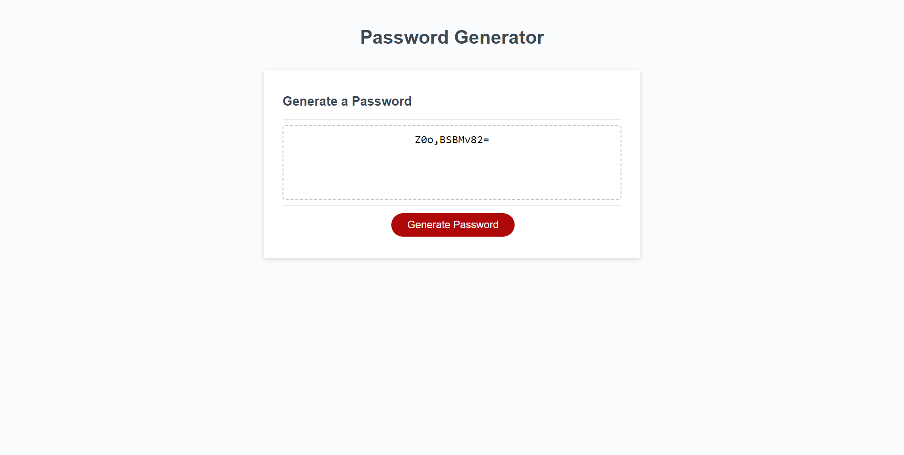

# Module 3 Challenge

## Description

This challenge was to create an application that prompts the user to generate a random password based on selected criteria. The application use HTML, CSS, and JavaScript to create the prompt and generate the password.

## Installation

N/A

## Usage

To use this webpage, you may open the page using the Github pages link or this [link](https://tkmarsten.github.io/module-3-challenge/).

## Credits

Tiarnan Marsten

## License

Please refer to the LICENSE in the repo.
